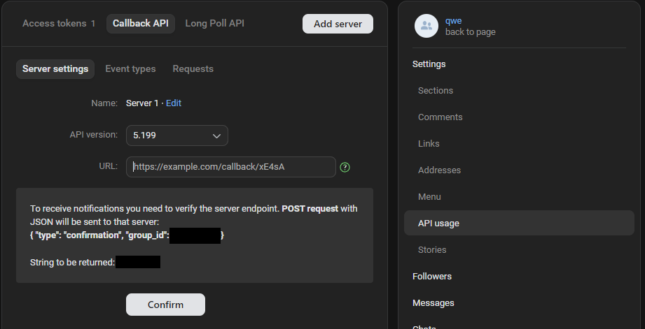
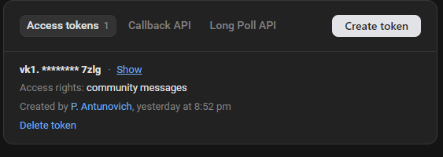

# Repeat bot

VK bot that repeats your messages. This is [BotAPI VK](https://dev.vk.com/ru/api/bots/getting-started)
integration using Kotlin with Spring Boot.

### Preparing 
First, clone this repository:

`git clone https://github.com/AntunovichPYU/RepeatBot.git`

Then you need to add this Callback-API configuration properties to your `application.properties`:

>`vk.properties.accessToken=`
>
>`vk.properties.confirmationToken=`
>
>`vk.properties.v=5.199`

You can find your confirmation token and access token in the group settings. Go to the settings, then 
to `API usage` section and then to the `Callback API` tab to find a confirmation token ("String to be
returned")

and then go to the `Access tokens` tab where you can create new token.

You can also specify API version but it's not recommended.

### Building project

Open the command line and move to the project directory. Then build .jar file with this command:

`gradle build`

### Run application

After this you may run application from jar file:

`java -jar build/libs/RepeatBot-1.0.0.jar`

Or using docker:

>`docker build -t repeatbot .`
>
>`docker run -d -p 8080:8080 repeatbot`

You'll also need to get public IP to be able to get access to your local server from outside. Use 
[ngrok](https://ngrok.com/): download it, run it and then use a command:

`ngrok http 8080`

to get a public HTTPS address.
